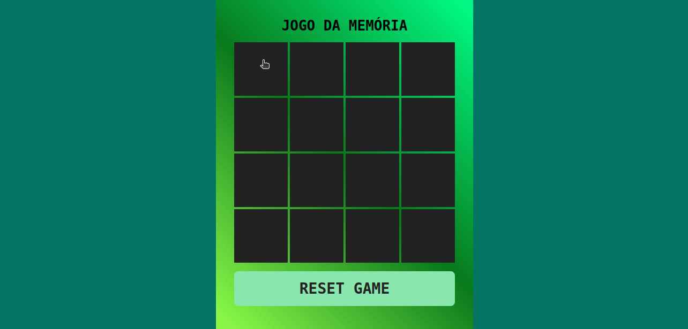

## FSM Jogo da Memória

## 🛠 Tecnologias Utilizadas

## 💻 Sobre o jogo

Teste sua mente com este desafiante jogo da memória, onde você precisa encontrar as combinações exatas entre as cartas.

## Instalação e execução

1. Faça o download do projeto clicando em **Code** e em seguida em **Download Zip**.

2. Extraia a pasta zipada.

3. Execute o arquivo index.html.
